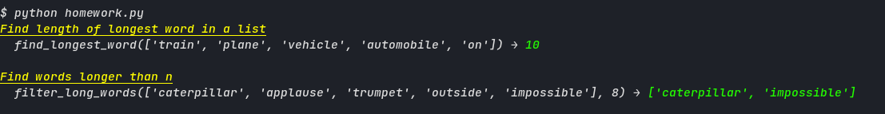

HomeworkPrint is a small Python class that can assit in documenting short, entry-level practice/homework exercises. 
It print the function's name, arguements used, and the results.

Example output:




Example use in an assignment/practice:

```py
part1 = HomeworkPrint(find_longest_word, desc="Find length of longest word in a list")
part1.pprint_heading()
part1.pprint_output(['train', 'plane', 'vehicle', 'automobile', 'on'], el=END)

part2 = HomeworkPrint(filter_long_words, desc="Find words longer than n")
part2.pprint_heading()
part2.pprint_output(['caterpillar', 'applause', 'trumpet', 'outside', 'impossible'], 8, el=END)
```
